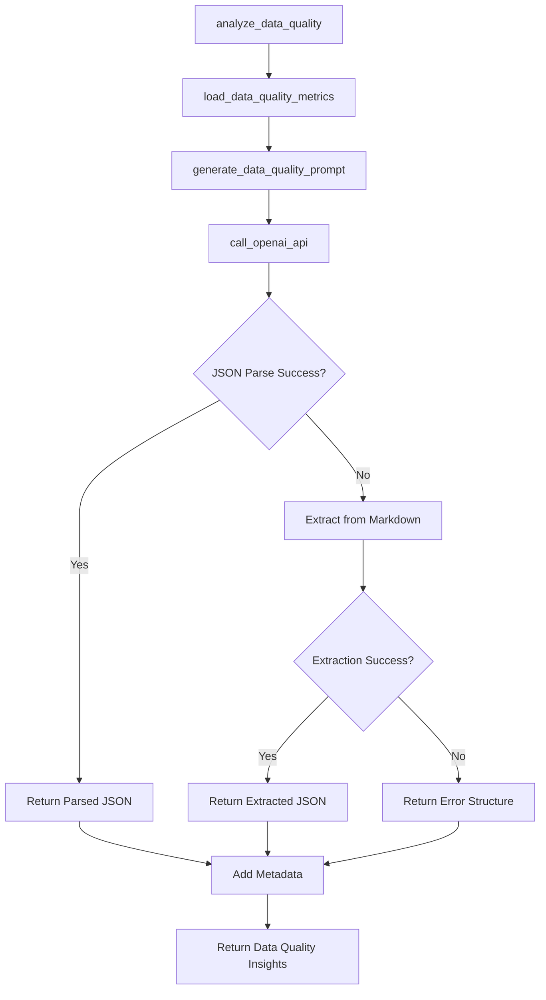

# LLM Child Data Quality & Improvement Analyst v1.0.0

## Overview
Specialized LLM for analyzing data quality and suggesting improvements. Part of the multi-LLM architecture, focusing specifically on data quality assessment and improvement recommendations.

## Functions

### `call_openai_api(prompt: str) -> Dict`
- **Purpose**: Calls OpenAI API to generate data quality insights
- **Input**: Data quality analysis prompt
- **Output**: Parsed JSON response or error structure
- **Tools**: OpenAI GPT-4 API
- **Variables**: 
  - Input: `prompt` (function parameter)
  - Environment: `OPENAI_API_KEY` (from environment)

### `load_data_quality_metrics(run_hash: str) -> Dict`
- **Purpose**: Loads data quality metrics from schema discovery and other sources
- **Input**: Run hash for data location
- **Output**: Dictionary containing data quality information
- **Tools**: JSON file reading, file system operations
- **Variables**:
  - Input: `run_hash` (function parameter)
  - File paths: `schema_mapping.json`, `aggregation_summary.json`, `segmentation_summary.json`
  - Computed: `schema_quality`, `aggregation_quality`, `segmentation_quality`

### `generate_data_quality_prompt(data: Dict, run_metadata: Dict) -> str`
- **Purpose**: Generates the data quality analysis prompt
- **Input**: Data quality data and run metadata
- **Output**: Formatted prompt string
- **Tools**: String formatting, JSON serialization
- **Variables**:
  - Input: `data`, `run_metadata` (function parameters)
  - Computed: Formatted prompt with quality metrics

### `analyze_data_quality(run_hash: str, run_metadata: Dict) -> Dict`
- **Purpose**: Main analysis function for data quality
- **Input**: Run hash and metadata
- **Output**: Data quality insights with metadata
- **Tools**: Data loading, prompt generation, LLM API
- **Variables**:
  - Input: `run_hash`, `run_metadata` (function parameters)
  - Computed: `insights`, `metadata`

### `main()`
- **Purpose**: Test function for standalone execution
- **Input**: None (uses environment variables)
- **Output**: Test results
- **Tools**: Environment variable access, JSON serialization
- **Variables**:
  - Environment: `RUN_HASH` (from environment)
  - Hardcoded: Test run metadata

## Tools Used
- **OpenAI API**: GPT-4 model for data quality analysis
- **JSON**: File reading and serialization
- **Regular Expressions**: JSON extraction from markdown
- **Datetime**: Timestamp generation

## Variables by Source

### Input Variables
- `run_hash`: Unique identifier for the current run
- `run_metadata`: Dictionary with run information (date range, data source)

### Environment Variables
- `OPENAI_API_KEY`: OpenAI API key for LLM access
- `RUN_HASH`: Current run identifier (for testing)

### File Input Variables
- `schema_mapping.json`: Schema discovery results and data quality metrics
- `aggregation_summary.json`: Data aggregation quality summary
- `segmentation_summary.json`: User segmentation quality summary

### Hardcoded Variables
- Model: "gpt-4"
- Temperature: 0.3
- Max tokens: 1000
- System prompt: Specialized data quality analyst role
- Data file paths: `run_logs/{run_hash}/outputs/schema/`, `run_logs/{run_hash}/outputs/aggregations/`, `run_logs/{run_hash}/outputs/segments/`

### Computed Variables
- `schema_quality`: Data quality metrics from schema discovery
- `aggregation_quality`: Quality metrics from data aggregation
- `segmentation_quality`: Quality metrics from user segmentation
- `insights`: Final analysis results
- `metadata`: Execution metadata (timestamp, run hash, analyst type)

## Function Call Flow

## Key Features
- **Focused Analysis**: Specialized in data quality assessment and improvement
- **Data Integration**: Loads quality metrics from multiple phases
- **Robust JSON Parsing**: Multiple fallback methods for response parsing
- **Quality Assessment**: Comprehensive data quality evaluation
- **Improvement Recommendations**: Actionable suggestions for data enhancement

## Analysis Focus Areas
- **Data Quality Assessment**: Overall quality score and key issues
- **Sample Size Adequacy**: Whether sample sizes are sufficient for analysis
- **Data Collection Gaps**: Missing or incomplete data areas
- **Analytics Infrastructure**: Recommendations for system improvements

## Dependencies
- `openai`: OpenAI API client
- `json`: JSON file reading and serialization
- `os`: Environment variable access
- `datetime`: Timestamp generation
- `re`: Regular expressions for JSON extraction

## Version History
- **v1.0.0** (2025-10-16): Initial version with data quality analysis capabilities
