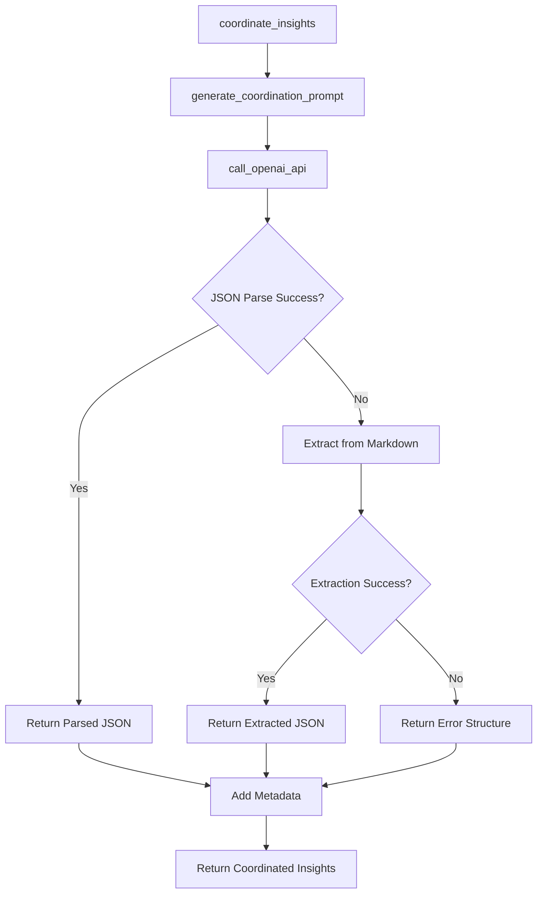

# LLM Coordinator v1.0.0

## Overview
Parent LLM that coordinates insights from multiple specialized child LLMs and synthesizes them into a comprehensive executive report. This script serves as the central orchestrator in the multi-LLM architecture.

## Functions

### `call_openai_api(prompt: str) -> Dict`
- **Purpose**: Calls OpenAI API to generate coordinated insights
- **Input**: Coordination prompt string
- **Output**: Parsed JSON response or error structure
- **Tools**: OpenAI GPT-4 API
- **Variables**: 
  - Input: `prompt` (function parameter)
  - Environment: `OPENAI_API_KEY` (from environment)

### `generate_coordination_prompt(child_outputs: Dict, run_metadata: Dict) -> str`
- **Purpose**: Generates concise coordination prompt for parent LLM
- **Input**: Child LLM outputs and run metadata
- **Output**: Optimized prompt string
- **Tools**: JSON serialization, string formatting
- **Variables**:
  - Input: `child_outputs`, `run_metadata` (function parameters)
  - Computed: Extracted key insights from each child analyst

### `coordinate_insights(child_outputs: Dict, run_metadata: Dict) -> Dict`
- **Purpose**: Main coordination function that synthesizes child insights
- **Input**: Child outputs and run metadata
- **Output**: Coordinated insights with metadata
- **Tools**: OpenAI API, JSON parsing, timestamp generation
- **Variables**:
  - Input: `child_outputs`, `run_metadata` (function parameters)
  - Environment: `OPENAI_API_KEY` (from environment)
  - Computed: `coordinated_insights`, `metadata`

### `main()`
- **Purpose**: Test function for standalone execution
- **Input**: None (uses test data)
- **Output**: Test results
- **Tools**: JSON serialization, print statements
- **Variables**:
  - Hardcoded: Test data for child outputs and run metadata

## Tools Used
- **OpenAI API**: GPT-4 model for insight synthesis
- **JSON**: Serialization and parsing
- **Regular Expressions**: JSON extraction from markdown
- **Datetime**: Timestamp generation

## Variables by Source

### Input Variables
- `child_outputs`: Dictionary containing outputs from all 6 child LLMs
- `run_metadata`: Dictionary with run information (hash, date range, user count)

### Environment Variables
- `OPENAI_API_KEY`: OpenAI API key for LLM access

### Hardcoded Variables
- Model: "gpt-4"
- Temperature: 0.2
- Max tokens: 2000
- System prompt: Senior product analytics director role

### Computed Variables
- `coordinated_insights`: Final synthesized insights
- `metadata`: Execution metadata (timestamp, run hash, etc.)
- `extracted_insights`: Key insights extracted from child outputs

## Function Call Flow

## Key Features
- **Token Optimization**: Concise prompts to stay within API limits
- **Robust JSON Parsing**: Multiple fallback methods for response parsing
- **Insight Extraction**: Intelligent extraction of key insights from child outputs
- **Error Handling**: Graceful handling of API failures and parsing errors
- **Metadata Tracking**: Comprehensive execution metadata

## Dependencies
- `openai`: OpenAI API client
- `json`: JSON serialization
- `os`: Environment variable access
- `datetime`: Timestamp generation
- `re`: Regular expressions for JSON extraction

## Version History
- **v1.0.0** (2025-10-16): Initial version with multi-LLM coordination capabilities
