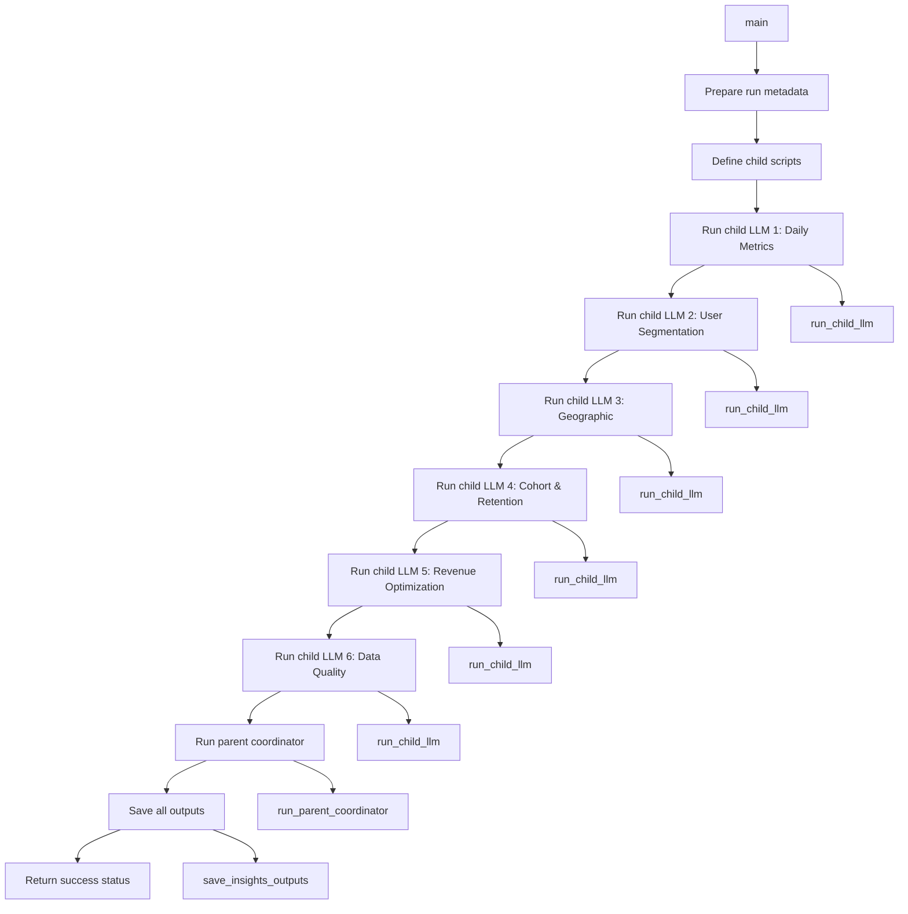

# Multi-LLM Insights Generation Script v1.0.0

## Overview
Main script that orchestrates the multi-LLM architecture for generating comprehensive insights. Coordinates 6 specialized child LLMs and 1 parent coordinator LLM to produce executive-level analytics reports.

## Functions

### `run_child_llm(script_name: str, run_hash: str, run_metadata: Dict) -> Dict`
- **Purpose**: Runs a child LLM script and returns its output
- **Input**: Script name, run hash, and run metadata
- **Output**: Child LLM analysis results
- **Tools**: Subprocess execution, JSON parsing
- **Variables**: 
  - Input: `script_name`, `run_hash`, `run_metadata` (function parameters)
  - Environment: `RUN_HASH` (set for child script)
  - Computed: `result`, parsed JSON output

### `run_parent_coordinator(child_outputs: Dict, run_metadata: Dict) -> Dict`
- **Purpose**: Runs the parent coordinator LLM
- **Input**: Child outputs and run metadata
- **Output**: Coordinated insights from parent LLM
- **Tools**: LLM coordinator module import
- **Variables**:
  - Input: `child_outputs`, `run_metadata` (function parameters)
  - Computed: `coordinated_insights`

### `save_insights_outputs(coordinated_insights: Dict, child_outputs: Dict, run_hash: str)`
- **Purpose**: Saves all insights outputs to the run directory
- **Input**: Coordinated insights, child outputs, and run hash
- **Output**: None (saves files to disk)
- **Tools**: File system operations, JSON serialization
- **Variables**:
  - Input: `coordinated_insights`, `child_outputs`, `run_hash` (function parameters)
  - Computed: `execution_summary`

### `main()`
- **Purpose**: Main multi-LLM insights generation function
- **Input**: None (uses environment variables)
- **Output**: Execution status code
- **Tools**: Environment variable access, subprocess execution
- **Variables**:
  - Environment: `RUN_HASH`, `DATE_START`, `DATE_END`, `AGGREGATION_LIMIT`
  - Computed: `run_metadata`, `child_outputs`, `coordinated_insights`

## Tools Used
- **Subprocess**: Child LLM script execution
- **JSON**: Serialization and parsing
- **File System**: Output file management
- **Environment Variables**: Configuration management
- **Regular Expressions**: JSON extraction from child outputs

## Variables by Source

### Input Variables
- `run_hash`: Unique identifier for the current run
- `run_metadata`: Dictionary with run information (date range, data source, user count)

### Environment Variables
- `RUN_HASH`: Current run identifier
- `DATE_START`: Analysis start date
- `DATE_END`: Analysis end date
- `AGGREGATION_LIMIT`: Data aggregation limit

### Hardcoded Variables
- Child script names: Dictionary mapping analyst types to script files
- Output file names: `coordinated_insights.json`, `child_insights.json`, `execution_summary.json`
- Output directory: `run_logs/{run_hash}/outputs/insights/`

### Computed Variables
- `run_metadata`: Formatted run metadata dictionary
- `child_outputs`: Dictionary containing outputs from all 6 child LLMs
- `coordinated_insights`: Final synthesized insights from parent coordinator
- `execution_summary`: Summary of execution status and results

## Function Call Flow

## Key Features
- **Multi-LLM Orchestration**: Coordinates 6 specialized child LLMs + 1 parent coordinator
- **Parallel Execution**: Runs child LLMs sequentially (can be optimized for true parallel execution)
- **Robust Error Handling**: Graceful handling of child LLM failures
- **Comprehensive Output**: Saves coordinated insights, child outputs, and execution summary
- **JSON Parsing**: Advanced JSON extraction from child LLM outputs

## Child LLM Scripts
1. **Daily Metrics Analyst**: `llm_child_daily_metrics_v1.py`
2. **User Segmentation Analyst**: `llm_child_user_segmentation_v1.py`
3. **Geographic Analyst**: `llm_child_geographic_v1.py`
4. **Cohort & Retention Analyst**: `llm_child_cohort_retention_v1.py`
5. **Revenue Optimization Analyst**: `llm_child_revenue_optimization_v1.py`
6. **Data Quality Analyst**: `llm_child_data_quality_v1.py`

## Output Files
- `coordinated_insights.json`: Final executive insights from parent coordinator
- `child_insights.json`: Individual outputs from all 6 child LLMs
- `execution_summary.json`: Execution status and summary statistics

## Dependencies
- `os`: Environment variable access and file operations
- `json`: JSON serialization and parsing
- `subprocess`: Child script execution
- `sys`: System operations and path management
- `datetime`: Timestamp generation
- `pathlib`: Path operations
- `re`: Regular expressions for JSON extraction

## Version History
- **v1.0.0** (2025-10-16): Initial version with multi-LLM orchestration capabilities
