# Analysis Workflow Orchestrator Script Documentation

## Script Overview

**File**: `scripts/analysis_workflow_orchestrator.py`  
**Version**: 1.0.0  
**Purpose**: Central orchestrator for the entire analysis workflow, automatically executing all phases from system initialization through final reporting.

## Functions

### Core Class Methods

#### `__init__(self)`
- **Purpose**: Initialize the orchestrator with default configuration
- **Parameters**: None
- **Returns**: None
- **Description**: Sets up run hash, start time, phase results tracking, and loads configuration

#### `_load_config(self) -> Dict`
- **Purpose**: Load configuration from environment variables and defaults
- **Parameters**: None
- **Returns**: Dictionary with configuration values
- **Description**: Loads all configuration parameters with fallback defaults

#### `_generate_run_hash(self) -> str`
- **Purpose**: Generate unique 6-character hash for run identification
- **Parameters**: None
- **Returns**: String hash
- **Description**: Creates unique identifier for each analysis run

#### `_create_run_structure(self, run_hash: str) -> Dict[str, Path]`
- **Purpose**: Create directory structure for the analysis run
- **Parameters**: 
  - `run_hash`: Unique run identifier
- **Returns**: Dictionary mapping directory names to Path objects
- **Description**: Creates all necessary directories for outputs, working files, and logs

#### `_create_run_env_file(self, run_hash: str, args: argparse.Namespace) -> Path`
- **Purpose**: Create run-specific environment file
- **Parameters**:
  - `run_hash`: Unique run identifier
  - `args`: Command line arguments
- **Returns**: Path to created environment file
- **Description**: Generates environment file with all necessary variables for the run

#### `_log_phase_start(self, phase_name: str, run_hash: str)`
- **Purpose**: Log the start of a phase
- **Parameters**:
  - `phase_name`: Name of the phase starting
  - `run_hash`: Unique run identifier
- **Returns**: None
- **Description**: Logs phase start to run log file

#### `_log_phase_completion(self, phase_name: str, run_hash: str, success: bool, details: str = "")`
- **Purpose**: Log the completion of a phase
- **Parameters**:
  - `phase_name`: Name of the phase completed
  - `run_hash`: Unique run identifier
  - `success`: Whether phase completed successfully
  - `details`: Additional details about completion
- **Returns**: None
- **Description**: Logs phase completion status to run log file

#### `_execute_script(self, script_path: str, run_hash: str, phase_name: str) -> Tuple[bool, str]`
- **Purpose**: Execute a Python script with proper environment setup
- **Parameters**:
  - `script_path`: Path to script to execute
  - `run_hash`: Unique run identifier
  - `phase_name`: Name of the phase for logging
- **Returns**: Tuple of (success: bool, output: str)
- **Description**: Executes script with environment variables and error handling

### Phase Execution Methods

#### `phase_0_system_initialization(self, run_hash: str, args: argparse.Namespace) -> bool`
- **Purpose**: Execute Phase 0 - System Initialization and Environment Setup
- **Parameters**:
  - `run_hash`: Unique run identifier
  - `args`: Command line arguments
- **Returns**: Boolean indicating success
- **Description**: Creates run structure, environment file, and runs system health check

#### `phase_1_schema_discovery(self, run_hash: str, args: argparse.Namespace) -> bool`
- **Purpose**: Execute Phase 1 - Schema Discovery and Field Mapping
- **Parameters**:
  - `run_hash`: Unique run identifier
  - `args`: Command line arguments
- **Returns**: Boolean indicating success
- **Description**: Runs enhanced schema discovery script and validates outputs

#### `phase_2_data_aggregation(self, run_hash: str, args: argparse.Namespace) -> bool`
- **Purpose**: Execute Phase 2 - Data Aggregation and Core Metric Generation
- **Parameters**:
  - `run_hash`: Unique run identifier
  - `args`: Command line arguments
- **Returns**: Boolean indicating success
- **Description**: Runs data aggregation script and validates outputs

#### `phase_3_user_segmentation(self, run_hash: str, args: argparse.Namespace) -> bool`
- **Purpose**: Execute Phase 3 - User Segmentation with Statistical Framework
- **Parameters**:
  - `run_hash`: Unique run identifier
  - `args`: Command line arguments
- **Returns**: Boolean indicating success
- **Description**: Creates user segments with statistical grounding (placeholder implementation)

#### `phase_4_quality_assurance(self, run_hash: str, args: argparse.Namespace) -> bool`
- **Purpose**: Execute Phase 4 - Quality Assurance and Validation
- **Parameters**:
  - `run_hash`: Unique run identifier
  - `args`: Command line arguments
- **Returns**: Boolean indicating success
- **Description**: Runs data validation and sanity checks (placeholder implementation)

#### `phase_5_llm_insights(self, run_hash: str, args: argparse.Namespace) -> bool`
- **Purpose**: Execute Phase 5 - LLM Insights Generation
- **Parameters**:
  - `run_hash`: Unique run identifier
  - `args`: Command line arguments
- **Returns**: Boolean indicating success
- **Description**: Generates AI-powered insights from metric tables (placeholder implementation)

#### `phase_6_final_reporting(self, run_hash: str, args: argparse.Namespace) -> bool`
- **Purpose**: Execute Phase 6 - Final Reporting and Organization
- **Parameters**:
  - `run_hash`: Unique run identifier
  - `args`: Command line arguments
- **Returns**: Boolean indicating success
- **Description**: Creates comprehensive run summary and organizes all outputs

#### `run_workflow(self, args: argparse.Namespace) -> bool`
- **Purpose**: Execute the complete analysis workflow
- **Parameters**:
  - `args`: Command line arguments
- **Returns**: Boolean indicating overall success
- **Description**: Main workflow execution method that coordinates all phases

### Main Function

#### `main()`
- **Purpose**: Main entry point for the analysis workflow orchestrator
- **Parameters**: None (uses command line arguments)
- **Returns**: None
- **Description**: Parses command line arguments, validates configuration, and executes workflow

## Tools & External Dependencies

### Command Line Tools
- **argparse**: Command line argument parsing and validation
- **subprocess**: Script execution, process management, and timeout handling
- **sys**: System-specific parameters and exit codes

### File System Tools
- **pathlib.Path**: Cross-platform path handling and directory operations
- **os**: Environment variables, system operations, and file permissions
- **json**: JSON serialization, deserialization, and file I/O

### Data Processing Tools
- **datetime**: Date and time operations, formatting, and calculations
- **secrets**: Cryptographically secure random number generation for run hashes
- **time**: Time-related functions for execution timing and delays

### External Script Dependencies
- **system_health_check.py**: System validation and BigQuery connection testing
- **schema_discovery_v3.py**: Schema discovery, field mapping, and data quality assessment
- **data_aggregation_v3.py**: Data aggregation, metric generation, and cohort analysis
- **user_segmentation_v1.py**: User segmentation, behavioral analysis, and funnel tracking
- **rules_engine_integration.py**: Advanced rule processing and validation (optional)

## Variables & Configuration

### Input Variables (Command Line Arguments)
- **`--quick`**: Boolean flag for abbreviated analysis mode
- **`--focus`**: String specifying analysis focus area (revenue, engagement, growth, health, retention)
- **`--mode`**: String specifying analysis mode (full, schema-only, aggregation-only, custom)
- **`--validate-only`**: Boolean flag for validation-only execution
- **`--app-filter`**: String for filtering by app name (e.g., "com.nukebox.mandir")
- **`--date-start`**: String for analysis start date (YYYY-MM-DD format)
- **`--date-end`**: String for analysis end date (YYYY-MM-DD format)
- **`--continue-on-error`**: Boolean flag for error handling behavior
- **`--dry-run`**: Boolean flag for simulation mode
- **`--raw-data-limit`**: Integer for raw data sampling limit
- **`--aggregation-limit`**: Integer for aggregation data limit
- **`--segmentation-minimum-sample-size`**: Integer for minimum sample size in segmentation
- **`--confidence-size-weight`**: Float for size confidence weight in segment confidence calculation
- **`--confidence-variance-weight`**: Float for variance confidence weight in segment confidence calculation
- **`--confidence-completeness-weight`**: Float for completeness confidence weight in segment confidence calculation

### Environment Variables (from .env files)
- **`DATASET_NAME`**: BigQuery dataset name (e.g., "gc-prod-459709.nbs_dataset.singular_user_level_event_data")
- **`DEFAULT_ITERATIONS`**: Default number of analysis iterations
- **`QUICK_ITERATIONS`**: Number of iterations for quick mode
- **`CONFIDENCE_THRESHOLD`**: Statistical confidence threshold (default: 0.85)
- **`MINIMUM_SAMPLE_SIZE`**: Minimum sample size for analysis (default: 30)
- **`ANALYSIS_WINDOW_DAYS`**: Analysis window in days (default: 60)
- **`STATISTICAL_SIGNIFICANCE`**: Statistical significance level (default: 0.05)
- **`MAX_QUERY_COST`**: Maximum query cost limit for BigQuery
- **`PARALLEL_QUERIES`**: Number of parallel queries allowed
- **`RETRY_ATTEMPTS`**: Number of retry attempts for failed operations
- **`TIMEOUT_SECONDS`**: Timeout for script execution (default: 300)
- **`GOOGLE_CLOUD_PROJECT`**: Google Cloud project ID
- **`GOOGLE_APPLICATION_CREDENTIALS`**: Path to Google Cloud service account credentials

### Hardcoded Variables
- **`DEFAULT_CONFIG`**: Dictionary with default configuration values
- **`PHASE_NAMES`**: List of phase names for workflow execution
- **`QUICK_PHASES`**: List of phases to execute in quick mode
- **`FOCUS_PHASES`**: Dictionary mapping focus areas to relevant phases
- **`RUN_HASH_LENGTH`**: Length of generated run hash (6 characters)
- **`DEFAULT_TIMEOUT`**: Default timeout for script execution (300 seconds)
- **`SUCCESS_EXIT_CODE`**: Exit code for successful execution (0)
- **`ERROR_EXIT_CODE`**: Exit code for failed execution (1)

### Computed Variables
- **`run_hash`**: Unique 6-character hash generated using secrets.token_hex()
- **`start_time`**: Timestamp when workflow execution begins
- **`phase_results`**: Dictionary tracking success/failure status of each phase
- **`run_directories`**: Dictionary mapping directory names to Path objects
- **`env_file_path`**: Path to run-specific environment file
- **`log_file_path`**: Path to run-specific log file
- **`config`**: Merged configuration from environment variables and defaults
- **`phases_to_run`**: List of phases to execute based on mode and focus
- **`execution_time`**: Total execution time calculated at workflow completion

## Flow Diagram

```mermaid
graph TD
    A[main] --> B[Parse Arguments]
    B --> C[Validate Configuration]
    C --> D[Create Orchestrator]
    D --> E[run_workflow]
    
    E --> F[Generate Run Hash]
    F --> G[Define Phases Based on Mode]
    G --> H[Execute Phases]
    
    H --> I[phase_0_system_initialization]
    I --> J[_create_run_structure]
    J --> K[_create_run_env_file]
    K --> L[_execute_script: system_health_check.py]
    
    L --> M[phase_1_schema_discovery]
    M --> N[_execute_script: schema_discovery_v3.py]
    
    N --> O[phase_2_data_aggregation]
    O --> P[_execute_script: data_aggregation_v3.py]
    
    P --> Q[phase_3_user_segmentation]
    Q --> R[Create Placeholder Outputs]
    
    R --> S[phase_4_quality_assurance]
    S --> T[Create Placeholder Outputs]
    
    T --> U[phase_5_llm_insights]
    U --> V[Create Placeholder Outputs]
    
    V --> W[phase_6_final_reporting]
    W --> X[Generate Run Summary]
    X --> Y[Create Index Files]
    
    Y --> Z[Return Success Status]
    
    style A fill:#e1f5fe
    style E fill:#f3e5f5
    style I fill:#e8f5e8
    style M fill:#e8f5e8
    style O fill:#e8f5e8
    style Q fill:#fff3e0
    style S fill:#fff3e0
    style U fill:#fff3e0
    style W fill:#e8f5e8
```



## Usage Examples

### Basic Usage
```bash
# Full comprehensive analysis
python scripts/analysis_workflow_orchestrator.py

# Quick analysis with fewer iterations
python scripts/analysis_workflow_orchestrator.py --quick

# Schema discovery only
python scripts/analysis_workflow_orchestrator.py --mode schema-only

# With app and date filters
python scripts/analysis_workflow_orchestrator.py --app-filter com.nukebox.mandir --date-start 2025-09-15 --date-end 2025-09-30
```

### Command Line Options
- `--quick`: Run abbreviated version
- `--focus`: Focus on specific area (revenue, engagement, growth, health, retention)
- `--mode`: Analysis mode (full, schema-only, aggregation-only, custom)
- `--validate-only`: Run validation checks only
- `--app-filter`: Filter by app name
- `--date-start/--date-end`: Date range filtering
- `--continue-on-error`: Continue execution even if phases fail
- `--dry-run`: Show what would be executed without running

## Dependencies

### Required Packages
- **Python 3.9+**: Core runtime
- **argparse**: Command line parsing (built-in)
- **subprocess**: Process execution (built-in)
- **pathlib**: Path handling (built-in)
- **json**: JSON processing (built-in)
- **datetime**: Date/time operations (built-in)
- **secrets**: Secure random generation (built-in)
- **os**: System operations (built-in)
- **sys**: System-specific parameters (built-in)
- **time**: Time-related functions (built-in)

### Environment Variables
- `DATASET_NAME`: BigQuery dataset name
- `DEFAULT_ITERATIONS`: Default number of iterations
- `QUICK_ITERATIONS`: Number of iterations for quick mode
- `CONFIDENCE_THRESHOLD`: Statistical confidence threshold
- `MINIMUM_SAMPLE_SIZE`: Minimum sample size for analysis
- `ANALYSIS_WINDOW_DAYS`: Analysis window in days
- `STATISTICAL_SIGNIFICANCE`: Statistical significance level
- `MAX_QUERY_COST`: Maximum query cost limit
- `PARALLEL_QUERIES`: Number of parallel queries
- `RETRY_ATTEMPTS`: Number of retry attempts
- `TIMEOUT_SECONDS`: Timeout for script execution

### External Script Dependencies
- `scripts/system_health_check.py`: System validation
- `scripts/schema_discovery_v3.py`: Schema discovery
- `scripts/data_aggregation_v3.py`: Data aggregation
- `scripts/rules_engine_integration.py`: Rules engine (optional)

## Error Handling

- **Configuration Validation**: Validates required environment variables
- **Script Execution**: Handles script execution errors with timeout
- **Phase Failure**: Configurable error handling (continue or stop)
- **File Operations**: Handles file creation and directory structure errors
- **Argument Validation**: Validates command line arguments and date formats

## Output Structure

Creates the following directory structure for each run:
```
run_logs/{run_hash}/
├── outputs/
│   ├── schema/              # Schema discovery outputs
│   ├── segments/            # User segmentation outputs
│   ├── aggregations/        # Data aggregation outputs
│   ├── validation/          # Quality assurance outputs
│   ├── reports/             # Final reports and insights
│   └── raw_data/            # Raw data samples
├── working/                 # Working scripts and queries
├── logs/                    # Execution logs
└── .env                     # Run-specific environment
```
