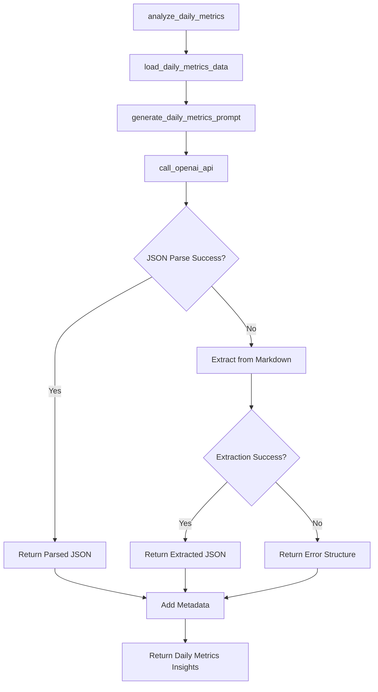

# LLM Child Daily Metrics Analyst v1.0.0

## Overview
Specialized LLM for analyzing daily active users, engagement trends, and core KPIs. Part of the multi-LLM architecture, focusing specifically on daily metrics analysis.

## Functions

### `call_openai_api(prompt: str) -> Dict`
- **Purpose**: Calls OpenAI API to generate daily metrics insights
- **Input**: Daily metrics analysis prompt
- **Output**: Parsed JSON response or error structure
- **Tools**: OpenAI GPT-4 API
- **Variables**: 
  - Input: `prompt` (function parameter)
  - Environment: `OPENAI_API_KEY` (from environment)

### `load_daily_metrics_data(run_hash: str) -> Dict`
- **Purpose**: Loads daily metrics data from Phase 3 outputs
- **Input**: Run hash for data location
- **Output**: Dictionary containing DAU and engagement data
- **Tools**: Pandas for CSV reading, file system operations
- **Variables**:
  - Input: `run_hash` (function parameter)
  - File paths: `dau_by_date.csv`, `engagement_by_date.csv`
  - Computed: `dau_summary`, `engagement_data`

### `generate_daily_metrics_prompt(data: Dict, run_metadata: Dict) -> str`
- **Purpose**: Generates the daily metrics analysis prompt
- **Input**: Daily metrics data and run metadata
- **Output**: Formatted prompt string
- **Tools**: String formatting, JSON serialization
- **Variables**:
  - Input: `data`, `run_metadata` (function parameters)
  - Computed: Formatted prompt with data snippets

### `analyze_daily_metrics(run_hash: str, run_metadata: Dict) -> Dict`
- **Purpose**: Main analysis function for daily metrics
- **Input**: Run hash and metadata
- **Output**: Daily metrics insights with metadata
- **Tools**: Data loading, prompt generation, LLM API
- **Variables**:
  - Input: `run_hash`, `run_metadata` (function parameters)
  - Computed: `insights`, `metadata`

### `main()`
- **Purpose**: Test function for standalone execution
- **Input**: None (uses environment variables)
- **Output**: Test results
- **Tools**: Environment variable access, JSON serialization
- **Variables**:
  - Environment: `RUN_HASH` (from environment)
  - Hardcoded: Test run metadata

## Tools Used
- **OpenAI API**: GPT-4 model for daily metrics analysis
- **Pandas**: Data manipulation and CSV reading
- **JSON**: Serialization and parsing
- **Regular Expressions**: JSON extraction from markdown
- **Datetime**: Timestamp generation

## Variables by Source

### Input Variables
- `run_hash`: Unique identifier for the current run
- `run_metadata`: Dictionary with run information (date range, data source)

### Environment Variables
- `OPENAI_API_KEY`: OpenAI API key for LLM access
- `RUN_HASH`: Current run identifier (for testing)

### File Input Variables
- `dau_by_date.csv`: Daily active users data
- `engagement_by_date.csv`: User engagement metrics data

### Hardcoded Variables
- Model: "gpt-4"
- Temperature: 0.3
- Max tokens: 1000
- System prompt: Specialized daily metrics analyst role
- Data file paths: `run_logs/{run_hash}/outputs/segments/daily/`

### Computed Variables
- `dau_summary`: Summary statistics from DAU data
- `insights`: Final analysis results
- `metadata`: Execution metadata (timestamp, run hash, analyst type)

## Function Call Flow

## Key Features
- **Focused Analysis**: Specialized in daily metrics and engagement patterns
- **Data Integration**: Loads data from Phase 3 segmentation outputs
- **Robust JSON Parsing**: Multiple fallback methods for response parsing
- **Summary Statistics**: Generates key metrics from raw data
- **Error Handling**: Graceful handling of missing data and API failures

## Analysis Focus Areas
- **DAU Trends**: Growth/decline patterns, consistency, seasonality
- **Engagement Patterns**: User activity consistency, peak periods
- **Growth Indicators**: New vs returning user trends
- **Performance Metrics**: Key KPIs and their trends

## Dependencies
- `openai`: OpenAI API client
- `pandas`: Data manipulation and analysis
- `json`: JSON serialization
- `os`: Environment variable access
- `datetime`: Timestamp generation
- `re`: Regular expressions for JSON extraction

## Version History
- **v1.0.0** (2025-10-16): Initial version with daily metrics analysis capabilities
