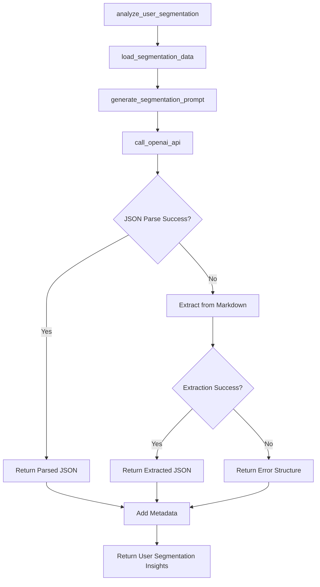

# LLM Child User Segmentation Analyst v1.0.0

## Overview
Specialized LLM for analyzing user behavior segments and journey patterns. Part of the multi-LLM architecture, focusing specifically on user segmentation and behavioral analysis.

## Functions

### `call_openai_api(prompt: str) -> Dict`
- **Purpose**: Calls OpenAI API to generate user segmentation insights
- **Input**: User segmentation analysis prompt
- **Output**: Parsed JSON response or error structure
- **Tools**: OpenAI GPT-4 API
- **Variables**: 
  - Input: `prompt` (function parameter)
  - Environment: `OPENAI_API_KEY` (from environment)

### `load_segmentation_data(run_hash: str) -> Dict`
- **Purpose**: Loads user segmentation data from Phase 3 outputs
- **Input**: Run hash for data location
- **Output**: Dictionary containing journey and revenue segment data
- **Tools**: Pandas for CSV reading, file system operations
- **Variables**:
  - Input: `run_hash` (function parameter)
  - File paths: `user_journey_cohort.csv`, `revenue_segments_daily.csv`
  - Computed: `journey_summary`, `segment_distribution`

### `generate_segmentation_prompt(data: Dict, run_metadata: Dict) -> str`
- **Purpose**: Generates the user segmentation analysis prompt
- **Input**: Segmentation data and run metadata
- **Output**: Formatted prompt string
- **Tools**: String formatting, JSON serialization
- **Variables**:
  - Input: `data`, `run_metadata` (function parameters)
  - Computed: Formatted prompt with data snippets

### `analyze_user_segmentation(run_hash: str, run_metadata: Dict) -> Dict`
- **Purpose**: Main analysis function for user segmentation
- **Input**: Run hash and metadata
- **Output**: User segmentation insights with metadata
- **Tools**: Data loading, prompt generation, LLM API
- **Variables**:
  - Input: `run_hash`, `run_metadata` (function parameters)
  - Computed: `insights`, `metadata`

### `main()`
- **Purpose**: Test function for standalone execution
- **Input**: None (uses environment variables)
- **Output**: Test results
- **Tools**: Environment variable access, JSON serialization
- **Variables**:
  - Environment: `RUN_HASH` (from environment)
  - Hardcoded: Test run metadata

## Tools Used
- **OpenAI API**: GPT-4 model for user segmentation analysis
- **Pandas**: Data manipulation and CSV reading
- **JSON**: Serialization and parsing
- **Regular Expressions**: JSON extraction from markdown
- **Datetime**: Timestamp generation

## Variables by Source

### Input Variables
- `run_hash`: Unique identifier for the current run
- `run_metadata`: Dictionary with run information (date range, data source)

### Environment Variables
- `OPENAI_API_KEY`: OpenAI API key for LLM access
- `RUN_HASH`: Current run identifier (for testing)

### File Input Variables
- `user_journey_cohort.csv`: User journey and cohort data
- `revenue_segments_daily.csv`: Revenue segment distribution data

### Hardcoded Variables
- Model: "gpt-4"
- Temperature: 0.3
- Max tokens: 1000
- System prompt: Specialized user segmentation analyst role
- Data file paths: `run_logs/{run_hash}/outputs/segments/user_level/`

### Computed Variables
- `journey_summary`: Summary statistics from journey data
- `segment_distribution`: Revenue segment distribution
- `insights`: Final analysis results
- `metadata`: Execution metadata (timestamp, run hash, analyst type)

## Function Call Flow

## Key Features
- **Focused Analysis**: Specialized in user segmentation and behavioral patterns
- **Data Integration**: Loads data from Phase 3 segmentation outputs
- **Robust JSON Parsing**: Multiple fallback methods for response parsing
- **Segment Analysis**: Analyzes performance across user segments
- **Journey Mapping**: Identifies common paths and drop-off points

## Analysis Focus Areas
- **Segment Performance**: Compare performance across user segments
- **User Journey Patterns**: Identify common paths and progression
- **Behavioral Insights**: Key behavioral patterns and characteristics
- **Segment Opportunities**: Opportunities for segment-specific strategies

## Dependencies
- `openai`: OpenAI API client
- `pandas`: Data manipulation and analysis
- `json`: JSON serialization
- `os`: Environment variable access
- `datetime`: Timestamp generation
- `re`: Regular expressions for JSON extraction

## Version History
- **v1.0.0** (2025-10-16): Initial version with user segmentation analysis capabilities
