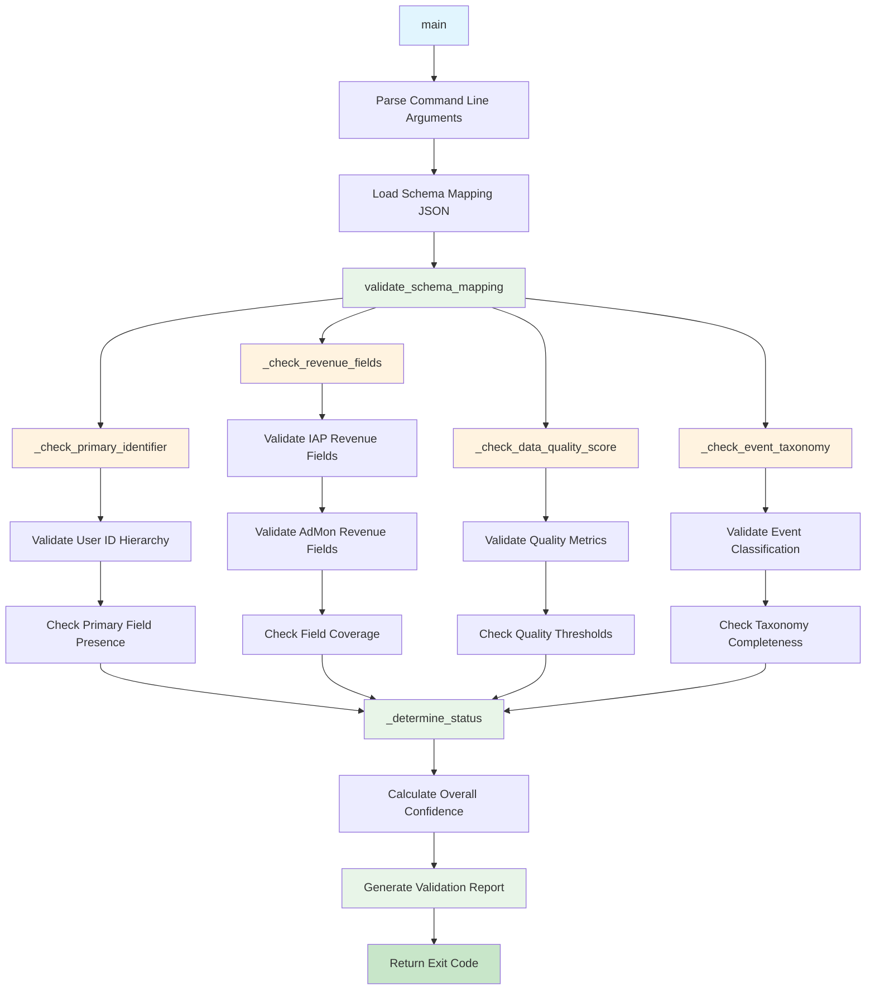

# Rules Engine Integration Script Documentation

## Script Overview

**File**: `scripts/rules_engine_integration.py`  
**Version**: 1.0.0  
**Purpose**: Advanced rule processing capabilities and integration with the schema discovery workflow for business logic validation.

## Functions

### Core Utility Functions

#### `_determine_status(checks: List[Dict[str, object]]) -> str`
- **Purpose**: Aggregate overall status from individual checks
- **Parameters**:
  - `checks`: List of check result dictionaries
- **Returns**: Overall status string ("pass", "warn", or "fail")
- **Description**: Determines the most severe status from a list of validation checks

#### `_confidence(values: List[float]) -> float`
- **Purpose**: Return bounded average confidence score
- **Parameters**:
  - `values`: List of confidence values
- **Returns**: Bounded average confidence (0.0 to 1.0)
- **Description**: Calculates average confidence with bounds checking

### Validation Check Functions

#### `_check_primary_identifier(schema_mapping, user_rules, schema_columns) -> Dict[str, object]`
- **Purpose**: Validate primary user identifier field
- **Parameters**:
  - `schema_mapping`: Complete schema mapping dictionary
  - `user_rules`: User identification rules from schema discovery
  - `schema_columns`: Schema column information
- **Returns**: Validation check result dictionary
- **Description**: Ensures primary user identifier is present and valid

#### `_check_revenue_fields(revenue_schemas, schema_columns) -> Dict[str, object]`
- **Purpose**: Validate revenue field coverage and availability
- **Parameters**:
  - `revenue_schemas`: Revenue schema information
  - `schema_columns`: Schema column information
- **Returns**: Validation check result dictionary
- **Description**: Validates that required revenue fields are present in schema

#### `_check_data_quality_score(schema_mapping) -> Dict[str, object]`
- **Purpose**: Validate data quality score and metrics
- **Parameters**:
  - `schema_mapping`: Complete schema mapping dictionary
- **Returns**: Validation check result dictionary
- **Description**: Ensures data quality metrics meet minimum thresholds

#### `_check_event_taxonomy(event_taxonomy) -> Dict[str, object]`
- **Purpose**: Validate event taxonomy and classification
- **Parameters**:
  - `event_taxonomy`: Event taxonomy information
- **Returns**: Validation check result dictionary
- **Description**: Validates event classification and taxonomy completeness

### Main Validation Function

#### `validate_schema_mapping(schema_mapping: Dict[str, object]) -> Dict[str, object]`
- **Purpose**: Comprehensive validation of schema mapping
- **Parameters**:
  - `schema_mapping`: Complete schema mapping dictionary
- **Returns**: Validation results dictionary
- **Description**: Orchestrates all validation checks and returns comprehensive results

### Utility Functions

#### `_load_json(path: Path) -> Dict[str, object]`
- **Purpose**: Load JSON file with error handling
- **Parameters**:
  - `path`: Path to JSON file
- **Returns**: Parsed JSON dictionary
- **Description**: Safely loads JSON files with proper error handling

#### `main() -> int`
- **Purpose**: Main entry point for rules engine validation
- **Parameters**: None
- **Returns**: Exit code (0 for success, 1 for failure)
- **Description**: Command-line interface for running validation checks

## External Tools & APIs

### Data Processing
- **JSON**: JSON serialization and deserialization
- **Statistics**: Statistical calculations (mean, confidence intervals)
- **Pathlib**: Path handling for file operations

### Command Line Interface
- **argparse**: Command line argument parsing
- **datetime**: Date and time operations

### File Operations
- **OS**: System operations and environment access

## Flow Diagram



## Usage Examples

### Direct Execution
```bash
# Validate schema mapping from specific run
python scripts/rules_engine_integration.py --run-hash abc123

# Validate specific schema mapping file
python scripts/rules_engine_integration.py --schema-file run_logs/abc123/outputs/schema/schema_mapping.json
```

### From Schema Discovery
```bash
# Rules engine is called during schema discovery validation
python scripts/schema_discovery_v3.py
```

### Command Line Options
```bash
# Show help
python scripts/rules_engine_integration.py --help

# Validate with verbose output
python scripts/rules_engine_integration.py --run-hash abc123 --verbose
```

## Dependencies

### Required Packages
- **json**: JSON serialization (built-in)
- **statistics**: Statistical calculations (built-in)
- **pathlib**: Path handling (built-in)
- **argparse**: Command line parsing (built-in)
- **datetime**: Date/time operations (built-in)
- **typing**: Type hints (built-in)

### Environment Variables
- **RUN_HASH**: Unique identifier for the current run (optional)
- **SCHEMA_FILE**: Path to schema mapping file (optional)

## Validation Rules

### Primary Identifier Validation
- **Rule**: Primary user identifier must be present in schema
- **Check**: Validates user identification hierarchy
- **Status**: "pass" if present, "fail" if missing
- **Confidence**: Based on schema discovery confidence

### Revenue Field Validation
- **Rule**: Required revenue fields must be present
- **Check**: Validates IAP and AdMon revenue fields
- **Status**: "pass" if all present, "fail" if missing, "warn" if none detected
- **Confidence**: Based on field detection confidence

### Data Quality Validation
- **Rule**: Data quality score must meet minimum thresholds
- **Check**: Validates overall data quality metrics
- **Status**: "pass" if above threshold, "warn" if below
- **Confidence**: Based on quality score

### Event Taxonomy Validation
- **Rule**: Event taxonomy must be complete and valid
- **Check**: Validates event classification and taxonomy
- **Status**: "pass" if complete, "warn" if incomplete
- **Confidence**: Based on taxonomy completeness

## Output Format

### Validation Result Structure
```json
{
  "overall_status": "pass|warn|fail",
  "overall_confidence": 0.85,
  "checks": [
    {
      "id": "user-primary-field",
      "status": "pass",
      "confidence": 0.9,
      "details": "Primary identifier 'device_id' present in schema.",
      "recommendation": null
    }
  ],
  "timestamp": "2025-10-14T12:00:00Z"
}
```

### Status Levels
- **pass**: All validations passed
- **warn**: Some validations failed but not critical
- **fail**: Critical validations failed

## Error Handling

### File Errors
- Missing schema mapping files
- Invalid JSON format
- Permission denied errors

### Validation Errors
- Missing required fields
- Invalid data types
- Schema inconsistencies

### Output Errors
- JSON serialization failures
- File write permissions
- Directory creation failures

## Integration Points

### With Schema Discovery
- Called during schema discovery validation phase
- Validates schema mapping completeness
- Provides business rule validation

### With Data Aggregation
- Ensures schema mapping is valid before aggregation
- Validates required fields are present
- Provides confidence scores for downstream processing

### With Orchestrator
- Integrated into Phase 1 validation
- Provides validation status for workflow decisions
- Enables conditional workflow execution

## Business Rules

### User Identification Rules
- Primary identifier must be present
- Fallback identifiers must be available
- User hierarchy must be complete

### Revenue Validation Rules
- IAP revenue fields must be present
- AdMon revenue fields must be present
- Revenue validation fields must be available

### Data Quality Rules
- Overall quality score must meet threshold
- Critical fields must have acceptable null rates
- Data completeness must be sufficient

### Event Taxonomy Rules
- Event classification must be complete
- Level events must be properly identified
- Engagement events must be categorized
