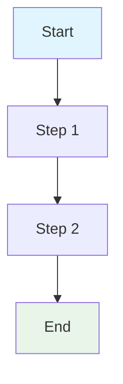

# [Script Name] Documentation Template

## Script Overview

**File**: `scripts/[script_name].py`  
**Version**: [X.Y.Z]  
**Purpose**: [Brief description of what the script does and its role in the workflow]

## Functions

### [Function Category 1]

#### `function_name(parameters)`
- **Purpose**: [What this function does]
- **Parameters**:
  - `param1`: [Description and type]
  - `param2`: [Description and type]
- **Returns**: [Return type and description]
- **Description**: [Detailed explanation of function behavior]

### [Function Category 2]

#### `another_function(parameters)`
- **Purpose**: [What this function does]
- **Parameters**:
  - `param1`: [Description and type]
- **Returns**: [Return type and description]
- **Description**: [Detailed explanation of function behavior]

## Tools & External Dependencies

### [Tool Category 1]
- **[Tool Name]**: [Brief description of what the tool does and how it's used]

### [Tool Category 2]
- **[Tool Name]**: [Brief description of what the tool does and how it's used]

### [Tool Category 3]
- **[Tool Name]**: [Brief description of what the tool does and how it's used]

## Variables & Configuration

### Input Variables (Function Parameters)
- **`param_name`**: [Description, type, and usage context]

### Environment Variables (from .env files)
- **`ENV_VAR_NAME`**: [Description, default value, and usage context]

### Hardcoded Variables
- **`CONSTANT_NAME`**: [Description and value/configuration]

### Computed Variables
- **`computed_var`**: [Description of how it's calculated and used]

## Flow Diagram



## Usage Examples

### Basic Usage
```bash
python scripts/[script_name].py [options]
```

### Advanced Usage
```bash
python scripts/[script_name].py --option1 value1 --option2 value2
```

## Dependencies

### Required Packages
- **[package_name]**: [Purpose and usage]

### Optional Dependencies
- **[package_name]**: [Purpose and usage]

## Error Handling

- **[Error Type]**: [How it's handled]
- **[Error Type]**: [How it's handled]

## Output Structure

Creates the following outputs:
```
output_directory/
├── file1.ext
├── file2.ext
└── subdirectory/
    └── file3.ext
```

## Notes

- [Important notes about the script]
- [Known limitations or considerations]
- [Future improvements or planned changes]
