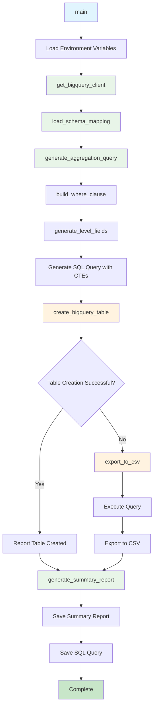

# Data Aggregation v3 Script Documentation

## Script Overview

**File**: `scripts/data_aggregation_v3.py`  
**Version**: 3.0.0  
**Purpose**: Final working version of data aggregation with session duration calculation, revenue classification, and comprehensive user-daily aggregation.

## Functions

### Core Connection Functions

#### `get_bigquery_client()`
- **Purpose**: Initialize BigQuery client with credentials
- **Parameters**: None
- **Returns**: BigQuery client instance
- **Description**: Creates authenticated BigQuery client using service account credentials

#### `load_schema_mapping(run_hash)`
- **Purpose**: Load schema mapping from previous run
- **Parameters**:
  - `run_hash`: Unique run identifier
- **Returns**: Schema mapping dictionary or None on error
- **Description**: Loads schema mapping JSON file created by schema discovery phase

#### `build_where_clause(app_filter, date_start, date_end)`
- **Purpose**: Build WHERE clause for SQL queries based on filters
- **Parameters**:
  - `app_filter`: App name filter (optional)
  - `date_start`: Start date filter (optional)
  - `date_end`: End date filter (optional)
- **Returns**: SQL WHERE clause string
- **Description**: Constructs WHERE clause for filtering data by app and date range

### Dynamic Field Generation Functions

#### `generate_level_fields(events)`
- **Purpose**: Generate dynamic level fields based on available events
- **Parameters**:
  - `events`: Dictionary of event counts from schema mapping
- **Returns**: Tuple of (level_fields, level_counts, level_events)
- **Description**: Dynamically generates SQL fields for level events based on discovered events

### Query Generation Functions

#### `generate_aggregation_query(dataset_name, schema_mapping, limit=1000)`
- **Purpose**: Generate the main aggregation query with enhanced features
- **Parameters**:
  - `dataset_name`: BigQuery dataset name
  - `schema_mapping`: Schema mapping from discovery phase
  - `limit`: Maximum number of rows to return
- **Returns**: SQL query string
- **Description**: Generates comprehensive user-daily aggregation query with:
  - Session duration calculation using CTEs
  - User cohort definition
  - Revenue classification (IAP, ads, subscription)
  - Dynamic level fields
  - Data quality metrics
  - Geographic and attribution data

### Data Export Functions

#### `create_bigquery_table(client, query, target_project, target_dataset, table_name)`
- **Purpose**: Attempt to create BigQuery table with aggregation results
- **Parameters**:
  - `client`: BigQuery client instance
  - `query`: SQL query to execute
  - `target_project`: Target project ID
  - `target_dataset`: Target dataset name
  - `table_name`: Target table name
- **Returns**: Boolean indicating success
- **Description**: Attempts to create BigQuery table, handles permission errors gracefully

#### `export_to_csv(client, query, output_path)`
- **Purpose**: Export aggregation results to CSV file
- **Parameters**:
  - `client`: BigQuery client instance
  - `query`: SQL query to execute
  - `output_path`: Path for CSV output file
- **Returns**: Boolean indicating success
- **Description**: Executes query and exports results to CSV with proper formatting

### Reporting Functions

#### `generate_summary_report(schema_mapping, output_path, success=True, table_created=False)`
- **Purpose**: Generate summary report for aggregation run
- **Parameters**:
  - `schema_mapping`: Schema mapping from discovery phase
  - `output_path`: Path for report output
  - `success`: Whether aggregation was successful
  - `table_created`: Whether BigQuery table was created
- **Returns**: None
- **Description**: Creates comprehensive summary report with run details and data quality metrics

#### `main()`
- **Purpose**: Main entry point for data aggregation
- **Parameters**: None
- **Returns**: None
- **Description**: Orchestrates the complete data aggregation process

## External Tools & APIs

### Google Cloud Services
- **BigQuery Client**: `google.cloud.bigquery.Client`
  - Purpose: Connect to BigQuery and execute aggregation queries
  - Usage: Data aggregation, table creation, CSV export

### Authentication
- **Service Account**: `google.oauth2.service_account.Credentials`
  - Purpose: Authenticate with Google Cloud services
  - Usage: Load credentials for BigQuery access

### Data Processing
- **Pandas**: Data manipulation and analysis
  - Purpose: Process query results and data formatting
  - Usage: DataFrame operations, CSV export

### Configuration Management
- **python-dotenv**: Environment variable loading
  - Purpose: Load configuration from .env files
  - Usage: Load aggregation limits and configuration

### File Operations
- **JSON**: JSON serialization and deserialization
- **Pathlib**: Path handling for output files
- **OS**: Environment variable access

## Flow Diagram



## Usage Examples

### Direct Execution
```bash
# Run with current environment
python scripts/data_aggregation_v3.py

# Run with specific configuration
AGGREGATION_LIMIT=1000 python scripts/data_aggregation_v3.py
```

### From Orchestrator
```bash
# Data aggregation is automatically run in Phase 2
python scripts/analysis_workflow_orchestrator.py
```

### Environment Setup
```bash
# Set required environment variables
export RUN_HASH=abc123
export DATASET_NAME=gc-prod-459709.nbs_dataset.singular_user_level_event_data
export APP_FILTER=com.nukebox.mandir
export DATE_START=2025-09-01
export DATE_END=2025-09-07
export AGGREGATION_LIMIT=1000
export GOOGLE_CLOUD_PROJECT=gc-prod-459709
export GOOGLE_APPLICATION_CREDENTIALS=/path/to/creds.json

# Run data aggregation
python scripts/data_aggregation_v3.py
```

## Dependencies

### Required Packages
- **google-cloud-bigquery**: BigQuery client library
- **google-oauth2**: OAuth2 authentication for Google Cloud
- **pandas**: Data manipulation and analysis
- **python-dotenv**: Environment variable loading
- **json**: JSON serialization (built-in)
- **datetime**: Date/time operations (built-in)
- **pathlib**: Path handling (built-in)
- **os**: Environment variable access (built-in)

### Environment Variables
- **RUN_HASH**: Unique identifier for the current run
- **DATASET_NAME**: BigQuery dataset name
- **APP_FILTER**: Filter by app name (optional)
- **DATE_START**: Start date for filtering (optional)
- **DATE_END**: End date for filtering (optional)
- **AGGREGATION_LIMIT**: Maximum rows to return (default: 1000)
- **GOOGLE_CLOUD_PROJECT**: Google Cloud project ID
- **GOOGLE_APPLICATION_CREDENTIALS**: Path to service account credentials

### Optional Environment Variables
- **TARGET_PROJECT**: Target project for table creation
- **TARGET_DATASET**: Target dataset for table creation
- **AGGREGATION_TABLE_NAME**: Name for aggregation table

## Output Files

### Aggregation Outputs
- **user_daily_aggregation_v3.csv**: Aggregated user-daily data
- **aggregation_sql_v3.sql**: Generated SQL query
- **aggregation_summary_report_v3.json**: Summary report with run details

### Working Files
- **aggregation_sql_enhanced.sql**: SQL query saved to working directory

## Aggregation Features

### Session Duration Calculation
- Uses CTEs to calculate session durations from timestamps
- Calculates average, maximum, and total session time
- Handles multiple sessions per day per user

### User Cohort Definition
- Identifies user cohorts based on first event date
- Calculates days since first event
- Classifies users as new or returning

### Revenue Classification
- Classifies revenue events by type (IAP, ads, subscription)
- Calculates revenue totals by type
- Counts revenue events by type
- Tracks first and last purchase times

### Dynamic Level Fields
- Generates level fields based on discovered events
- Creates level completion timestamps
- Calculates level completion counts
- Determines maximum level reached

### Data Quality Metrics
- Includes data quality score from schema discovery
- Tracks run hash for data lineage
- Records last updated timestamp
- Identifies data quality issues

### Geographic and Attribution
- Captures country, state, city information
- Records acquisition channel and campaign data
- Tracks UTM parameters
- Maintains app name for multi-app datasets

## SQL Query Structure

### Common Table Expressions (CTEs)
1. **session_durations**: Calculates session duration metrics
2. **user_cohorts**: Defines user cohorts based on first event date

### Main Query Features
- User-daily aggregation with comprehensive metrics
- Session duration calculations
- Revenue classification and totals
- Dynamic level field generation
- Data quality and metadata tracking
- Geographic and attribution data

## Error Handling

### Connection Errors
- BigQuery authentication failures
- Network connectivity issues
- Dataset access permissions

### Query Errors
- SQL syntax errors
- Column reference errors
- Data type mismatches
- Resource limits exceeded

### Export Errors
- File system permissions
- CSV export failures
- JSON serialization issues

### Fallback Mechanisms
- BigQuery table creation failure → CSV export
- Permission denied → Graceful degradation
- Query timeout → Error reporting

## Integration Points

### With Schema Discovery
- Loads schema mapping for dynamic field generation
- Uses event analysis for level field creation
- Applies data quality metrics from discovery

### With Orchestrator
- Called automatically in Phase 2 of the analysis workflow
- Provides aggregated data for subsequent phases
- Reports success/failure status

### With Other Scripts
- Provides aggregated data for user segmentation
- Supplies metric tables for LLM insights
- Creates foundation for quality assurance validation
