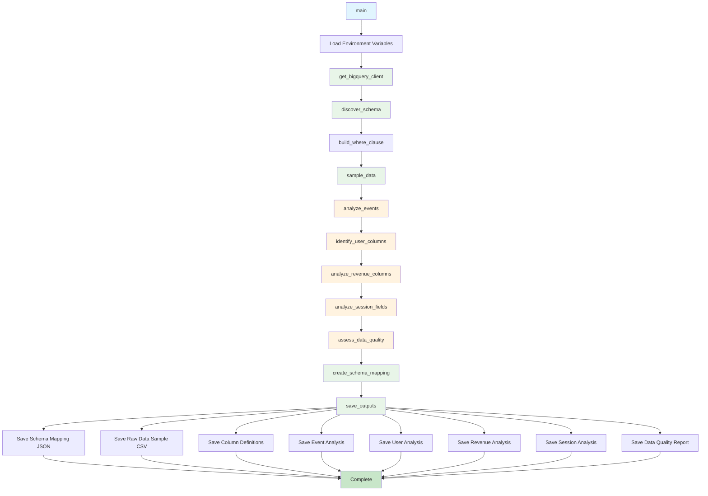

# Schema Discovery v3 Script Documentation

## Script Overview

**File**: `scripts/schema_discovery_v3.py`  
**Version**: 3.0.0  
**Purpose**: Enhanced schema discovery with session duration calculation, revenue classification, and comprehensive data quality assessment.

## Functions

### Core Connection Functions

#### `get_bigquery_client()`
- **Purpose**: Initialize BigQuery client with credentials
- **Parameters**: None
- **Returns**: BigQuery client instance
- **Description**: Creates authenticated BigQuery client using service account credentials

#### `build_where_clause(app_filter, date_start, date_end)`
- **Purpose**: Build WHERE clause for SQL queries based on filters
- **Parameters**:
  - `app_filter`: App name filter (optional)
  - `date_start`: Start date filter (optional)
  - `date_end`: End date filter (optional)
- **Returns**: SQL WHERE clause string
- **Description**: Constructs WHERE clause for filtering data by app and date range

### Data Discovery Functions

#### `get_available_apps(client, dataset_name)`
- **Purpose**: Get list of available apps in the dataset
- **Parameters**:
  - `client`: BigQuery client instance
  - `dataset_name`: Name of the dataset to query
- **Returns**: DataFrame with app information or None on error
- **Description**: Queries dataset to find all available apps with event counts and date ranges

#### `get_available_date_range(client, dataset_name, app_filter=None)`
- **Purpose**: Get available date range for dataset or specific app
- **Parameters**:
  - `client`: BigQuery client instance
  - `dataset_name`: Name of the dataset to query
  - `app_filter`: Optional app filter
- **Returns**: Series with date range information or None on error
- **Description**: Finds minimum and maximum dates with total event count

#### `discover_schema(client, dataset_name)`
- **Purpose**: Discover the schema of the dataset
- **Parameters**:
  - `client`: BigQuery client instance
  - `dataset_name`: Name of the dataset to query
- **Returns**: List of column information dictionaries
- **Description**: Retrieves column names, types, and metadata from BigQuery table schema

#### `sample_data(client, dataset_name, app_filter, date_start, date_end, limit=10000)`
- **Purpose**: Sample raw data from the dataset
- **Parameters**:
  - `client`: BigQuery client instance
  - `dataset_name`: Name of the dataset to query
  - `app_filter`: App name filter
  - `date_start`: Start date filter
  - `date_end`: End date filter
  - `limit`: Maximum number of rows to sample
- **Returns**: DataFrame with sampled data or None on error
- **Description**: Samples raw data for analysis and validation

### Analysis Functions

#### `analyze_events(df)`
- **Purpose**: Analyze event types and frequencies
- **Parameters**:
  - `df`: DataFrame with event data
- **Returns**: Dictionary with event analysis results
- **Description**: Identifies unique events, level events, and engagement patterns

#### `identify_user_columns(df)`
- **Purpose**: Identify and analyze user identification columns
- **Parameters**:
  - `df`: DataFrame with user data
- **Returns**: Dictionary with user column analysis
- **Description**: Analyzes custom_user_id, device_id, and other user identifiers

#### `analyze_revenue_columns(df)`
- **Purpose**: Analyze revenue-related columns and classification
- **Parameters**:
  - `df`: DataFrame with revenue data
- **Returns**: Dictionary with revenue analysis results
- **Description**: Identifies revenue columns, validates revenue data, and classifies revenue types

#### `analyze_session_fields(df)`
- **Purpose**: Analyze session-related fields for duration calculation
- **Parameters**:
  - `df`: DataFrame with session data
- **Returns**: Dictionary with session analysis results
- **Description**: Identifies session fields and determines session duration calculation approach

#### `assess_data_quality(df)`
- **Purpose**: Assess overall data quality and completeness
- **Parameters**:
  - `df`: DataFrame to assess
- **Returns**: Dictionary with data quality metrics
- **Description**: Calculates null rates, completeness scores, and identifies quality issues

### Schema Mapping Functions

#### `create_schema_mapping(schema, events, user_columns, revenue_columns, session_analysis, quality_metrics, app_filter, date_start, date_end, run_hash)`
- **Purpose**: Create comprehensive schema mapping with all analysis results
- **Parameters**:
  - `schema`: Dataset schema information
  - `events`: Event analysis results
  - `user_columns`: User column analysis
  - `revenue_columns`: Revenue analysis results
  - `session_analysis`: Session analysis results
  - `quality_metrics`: Data quality assessment
  - `app_filter`: Applied app filter
  - `date_start`: Applied start date
  - `date_end`: Applied end date
  - `run_hash`: Unique run identifier
- **Returns**: Dictionary with complete schema mapping
- **Description**: Consolidates all analysis results into comprehensive schema mapping

#### `save_outputs(schema_mapping, df, outputs_dir)`
- **Purpose**: Save all outputs to the run directory
- **Parameters**:
  - `schema_mapping`: Complete schema mapping dictionary
  - `df`: Raw data sample DataFrame
  - `outputs_dir`: Output directory path
- **Returns**: None
- **Description**: Saves schema mapping, raw data sample, and all analysis outputs

#### `main()`
- **Purpose**: Main entry point for schema discovery
- **Parameters**: None
- **Returns**: None
- **Description**: Orchestrates the complete schema discovery process

## External Tools & APIs

### Google Cloud Services
- **BigQuery Client**: `google.cloud.bigquery.Client`
  - Purpose: Connect to BigQuery and execute queries
  - Usage: Data sampling, schema discovery, app/date range queries

### Authentication
- **Service Account**: `google.oauth2.service_account.Credentials`
  - Purpose: Authenticate with Google Cloud services
  - Usage: Load credentials for BigQuery access

### Data Processing
- **Pandas**: Data manipulation and analysis
  - Purpose: Process sampled data and perform analysis
  - Usage: DataFrame operations, data quality assessment, event analysis

### File Operations
- **JSON**: JSON serialization and deserialization
- **Pathlib**: Path handling for output files
- **OS**: Environment variable access

## Flow Diagram



## Usage Examples

### Direct Execution
```bash
# Run with current environment
python scripts/schema_discovery_v3.py

# Run with specific filters
APP_FILTER=com.nukebox.mandir DATE_START=2025-09-01 DATE_END=2025-09-07 python scripts/schema_discovery_v3.py
```

### From Orchestrator
```bash
# Schema discovery is automatically run in Phase 1
python scripts/analysis_workflow_orchestrator.py
```

### Environment Setup
```bash
# Set required environment variables
export RUN_HASH=abc123
export DATASET_NAME=gc-prod-459709.nbs_dataset.singular_user_level_event_data
export APP_FILTER=com.nukebox.mandir
export DATE_START=2025-09-01
export DATE_END=2025-09-07
export RAW_DATA_LIMIT=10000
export GOOGLE_CLOUD_PROJECT=gc-prod-459709
export GOOGLE_APPLICATION_CREDENTIALS=/path/to/creds.json

# Run schema discovery
python scripts/schema_discovery_v3.py
```

## Dependencies

### Required Packages
- **google-cloud-bigquery**: BigQuery client library
- **google-oauth2**: OAuth2 authentication for Google Cloud
- **pandas**: Data manipulation and analysis
- **json**: JSON serialization (built-in)
- **datetime**: Date/time operations (built-in)
- **os**: Environment variable access (built-in)

### Environment Variables
- **RUN_HASH**: Unique identifier for the current run
- **DATASET_NAME**: BigQuery dataset name
- **APP_FILTER**: Filter by app name (optional)
- **DATE_START**: Start date for filtering (optional)
- **DATE_END**: End date for filtering (optional)
- **RAW_DATA_LIMIT**: Number of raw rows to sample (default: 10000)
- **GOOGLE_CLOUD_PROJECT**: Google Cloud project ID
- **GOOGLE_APPLICATION_CREDENTIALS**: Path to service account credentials

## Output Files

### Schema Outputs
- **schema_mapping.json**: Complete schema mapping with all analysis results
- **column_definitions.json**: Column definitions and types
- **event_analysis.json**: Event type analysis and classification
- **user_analysis.json**: User identification column analysis
- **revenue_analysis.json**: Revenue column analysis and classification
- **session_analysis.json**: Session field analysis for duration calculation
- **data_quality_report.json**: Data quality assessment and metrics

### Raw Data Outputs
- **sampled_raw_data.csv**: Sample of raw data for validation and analysis

## Analysis Features

### Event Analysis
- Identifies unique event types
- Classifies level events (div_level_1, div_level_2, etc.)
- Identifies engagement events (ftue_complete, game_complete, etc.)
- Analyzes event frequency and patterns

### User Identification Analysis
- Analyzes custom_user_id uniqueness and quality
- Evaluates device_id as fallback identifier
- Identifies other potential user identifiers
- Provides data quality recommendations

### Revenue Analysis
- Identifies revenue-related columns
- Classifies revenue types (IAP, ads, subscription)
- Validates revenue data quality
- Analyzes revenue event patterns

### Session Analysis
- Identifies session-related fields
- Determines session duration calculation approach
- Analyzes session patterns and quality
- Provides session metric recommendations

### Data Quality Assessment
- Calculates null rates for all columns
- Assesses data completeness
- Identifies data quality issues
- Provides overall quality score

## Error Handling

### Connection Errors
- BigQuery authentication failures
- Network connectivity issues
- Dataset access permissions

### Data Errors
- Empty datasets
- Invalid date ranges
- Missing required columns
- Data type inconsistencies

### Output Errors
- File system permissions
- JSON serialization issues
- CSV export failures

## Integration Points

### With Orchestrator
- Called automatically in Phase 1 of the analysis workflow
- Provides schema mapping for subsequent phases
- Validates data availability and quality

### With Data Aggregation
- Provides schema mapping for SQL generation
- Identifies available columns and data types
- Supplies data quality metrics for validation

### With Other Scripts
- Provides raw data samples for validation
- Supplies event analysis for metric generation
- Provides user identification recommendations
