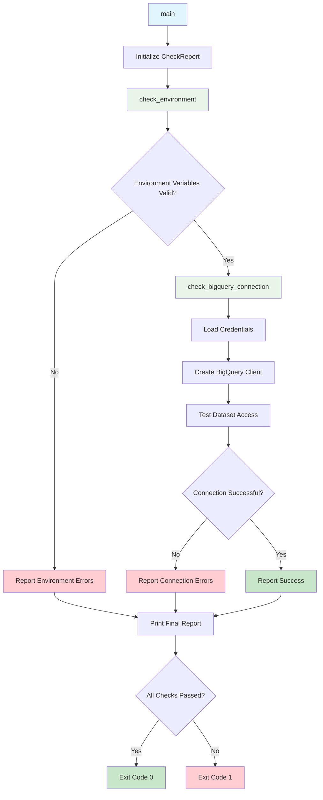

# System Health Check Script Documentation

## Script Overview

**File**: `scripts/system_health_check.py`  
**Version**: 2.1.0  
**Purpose**: Validates system environment, BigQuery connection, and required dependencies before starting analysis workflow.

## Functions

### Core Functions

#### `_infer_project_id(dataset_name: Optional[str]) -> Optional[str]`
- **Purpose**: Infer Google Cloud project ID from dataset name
- **Parameters**: 
  - `dataset_name`: Dataset name in format "project.dataset"
- **Returns**: Project ID string or None if not found
- **Description**: Extracts project ID from fully qualified dataset name

#### `check_environment(env: Optional[Dict[str, str]] = None) -> CheckReport`
- **Purpose**: Validate required environment variables are set and actionable
- **Parameters**:
  - `env`: Optional environment dictionary (defaults to os.environ)
- **Returns**: CheckReport with validation results
- **Description**: Checks for required environment variables and validates their values

#### `check_bigquery_connection(env: Optional[Dict[str, str]] = None) -> CheckReport`
- **Purpose**: Test BigQuery connection and validate credentials
- **Parameters**:
  - `env`: Optional environment dictionary (defaults to os.environ)
- **Returns**: CheckReport with connection test results
- **Description**: Attempts to connect to BigQuery and validates dataset access

#### `_emit_report(prefix: str, messages: List[str]) -> None`
- **Purpose**: Print formatted report messages
- **Parameters**:
  - `prefix`: Message prefix (e.g., "✅", "⚠️", "❌")
  - `messages`: List of messages to print
- **Returns**: None
- **Description**: Helper function for consistent message formatting

#### `main() -> int`
- **Purpose**: Main entry point for system health check
- **Parameters**: None
- **Returns**: Exit code (0 for success, 1 for failure)
- **Description**: Orchestrates all health checks and reports overall status

### Data Classes

#### `CheckReport`
- **Purpose**: Structured result container for health check steps
- **Fields**:
  - `passed: bool`: Whether the check passed
  - `warnings: List[str]`: List of warning messages
  - `errors: List[str]`: List of error messages
- **Description**: Standardized format for health check results

## External Tools & APIs

### Google Cloud Services
- **BigQuery Client**: `google.cloud.bigquery.Client`
  - Purpose: Connect to BigQuery and execute test queries
  - Usage: Validates dataset access and connection

### Authentication
- **Service Account**: `google.oauth2.service_account.Credentials`
  - Purpose: Authenticate with Google Cloud services
  - Usage: Load credentials from JSON file for BigQuery access

### System Operations
- **os**: Environment variable access and system operations
- **sys**: System-specific parameters and exit codes
- **pathlib**: Path handling for credential files

## Flow Diagram



## Usage Examples

### Direct Execution
```bash
# Run health check with current environment
python scripts/system_health_check.py

# Run with specific environment variables
RUN_HASH=test123 python scripts/system_health_check.py
```

### From Orchestrator
```bash
# Health check is automatically run in Phase 0
python scripts/analysis_workflow_orchestrator.py
```

### Environment Setup
```bash
# Set required environment variables
export RUN_HASH=abc123
export DATASET_NAME=gc-prod-459709.nbs_dataset.singular_user_level_event_data
export GOOGLE_CLOUD_PROJECT=gc-prod-459709
export GOOGLE_APPLICATION_CREDENTIALS=/path/to/creds.json

# Run health check
python scripts/system_health_check.py
```

## Dependencies

### Required Packages
- **google-cloud-bigquery**: BigQuery client library
- **google-oauth2**: OAuth2 authentication for Google Cloud
- **dataclasses**: Data structure definitions (Python 3.7+)
- **typing**: Type hints (Python 3.5+)

### Environment Variables
- **RUN_HASH**: Unique identifier for the current run
- **DATASET_NAME**: BigQuery dataset name (format: project.dataset.table)
- **GOOGLE_CLOUD_PROJECT**: Google Cloud project ID
- **GOOGLE_APPLICATION_CREDENTIALS**: Path to service account credentials JSON file

### Optional Environment Variables
- **BIGQUERY_LOCATION**: BigQuery dataset location (defaults to US)
- **BIGQUERY_MAX_RESULTS**: Maximum results for test queries (defaults to 1)

## Validation Checks

### Environment Validation
1. **Required Variables**: Checks for presence of all required environment variables
2. **Credential File**: Validates that credentials file exists and is readable
3. **Dataset Format**: Validates dataset name format (project.dataset.table)
4. **Project ID**: Extracts and validates project ID from dataset name

### BigQuery Connection Validation
1. **Credential Loading**: Loads and validates service account credentials
2. **Client Creation**: Creates BigQuery client with credentials
3. **Dataset Access**: Tests access to the specified dataset
4. **Query Execution**: Executes a simple test query to validate permissions

## Error Handling

### Environment Errors
- Missing required environment variables
- Invalid credential file paths
- Malformed dataset names
- Missing project ID

### Connection Errors
- Invalid credentials
- Network connectivity issues
- Insufficient permissions
- Dataset not found
- Project access denied

### Output Format
- **Success**: Green checkmarks (✅) for passed checks
- **Warnings**: Yellow warning signs (⚠️) for non-critical issues
- **Errors**: Red X marks (❌) for critical failures
- **Exit Codes**: 0 for success, 1 for failure

## Integration Points

### With Orchestrator
- Called automatically in Phase 0 of the analysis workflow
- Must pass before proceeding to schema discovery
- Provides validation of system readiness

### With Other Scripts
- Validates environment setup for all subsequent scripts
- Ensures BigQuery connectivity for data access
- Provides consistent error reporting format

## Output Examples

### Successful Check
```
🔍 **SYSTEM HEALTH CHECK STARTING...**
=====================================

✅ **Environment Check: PASSED**
✅ **BigQuery Connection: PASSED**

🎉 **ALL CHECKS PASSED - SYSTEM READY!**
```

### Failed Check
```
🔍 **SYSTEM HEALTH CHECK STARTING...**
=====================================

❌ **Environment Check: FAILED**
   • Missing required environment variable: DATASET_NAME
   • Invalid credentials file: /path/to/creds.json

❌ **BigQuery Connection: SKIPPED** (Environment check failed)

💥 **SYSTEM NOT READY - PLEASE FIX ISSUES ABOVE**
```
