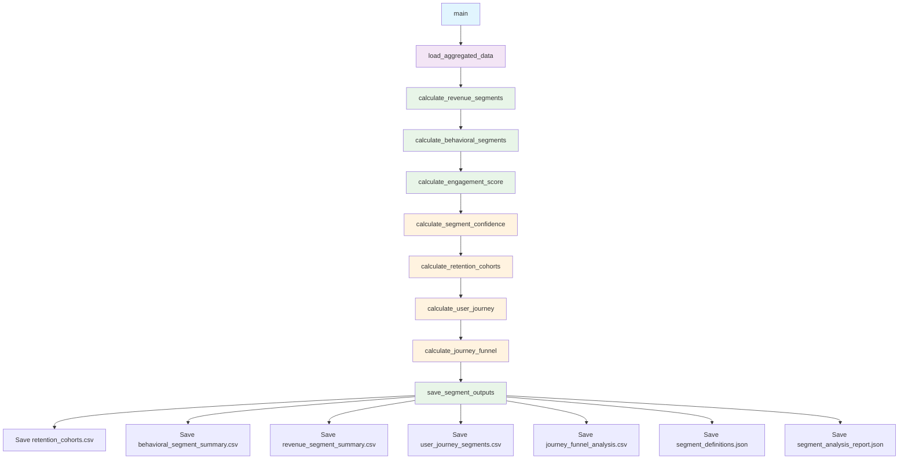

# User Segmentation v1 Script Documentation

## Overview
The `user_segmentation_v1.py` script implements Phase 3 of the analysis workflow, creating comprehensive user segments based on install cohorts, behavioral patterns, and revenue contribution. This script processes aggregated data from Phase 2 to generate segment classifications and statistical metrics.

## Version Information
- **Version**: 1.0.0
- **Last Updated**: 2025-10-14
- **Status**: Active
- **Phase**: 3 - User Segmentation

## Purpose
Create user segments for product analysis including:
- Install cohorts (day-level)
- Behavioral segments (engagement-based)
- Revenue segments (contribution-based)
- Retention cohort analysis
- User journey progression tracking

## Functions

### `load_aggregated_data(run_hash: str) -> pd.DataFrame`
**Purpose**: Load aggregated data from Phase 2 output
**Parameters**:
- `run_hash`: Unique identifier for the current run
**Returns**: DataFrame with aggregated user-daily data
**External Tools**: 
- Google Cloud BigQuery (if CSV not available)
- Pandas CSV reader
**Flow**: 
1. Try to load from CSV file first
2. Fall back to BigQuery table if CSV doesn't exist
3. Return loaded DataFrame

### `calculate_engagement_score(df: pd.DataFrame) -> pd.Series`
**Purpose**: Calculate normalized engagement score (0-1 scale) based on multiple metrics
**Parameters**:
- `df`: DataFrame with user activity data
**Returns**: Series with engagement scores
**External Tools**: 
- NumPy for numerical computations
- Environment variables for weight configuration
**Flow**:
1. Normalize session frequency, duration, event frequency, and recency
2. Apply configurable weights from environment variables
3. Calculate weighted combination
4. Return normalized scores

### `calculate_revenue_segments(df: pd.DataFrame) -> pd.DataFrame`
**Purpose**: Assign revenue-based user segments using percentile thresholds
**Parameters**:
- `df`: DataFrame with revenue data
**Returns**: DataFrame with revenue segment assignments
**External Tools**: 
- Pandas quantile calculations
- Environment variables for threshold configuration
**Flow**:
1. Calculate revenue percentiles
2. Assign segments: whale (95th+), dolphin (80-95th), minnow (0.1-80th), free_user (0)
3. Add revenue percentile rankings
4. Return updated DataFrame

### `calculate_behavioral_segments(df: pd.DataFrame) -> pd.DataFrame`
**Purpose**: Assign behavioral segments based on engagement patterns
**Parameters**:
- `df`: DataFrame with engagement data
**Returns**: DataFrame with behavioral segment assignments
**External Tools**:
- Pandas quantile calculations
- Environment variables for threshold configuration
**Flow**:
1. Calculate engagement scores
2. Define thresholds based on data distribution
3. Assign segments: high_engagement, moderate_engagement, low_engagement, churned
4. Return updated DataFrame

### `calculate_segment_confidence(df: pd.DataFrame, segment_column: str, segment_value: str) -> float`
**Purpose**: Calculate confidence score for segment assignment
**Parameters**:
- `df`: DataFrame with segment data
- `segment_column`: Name of segment column
- `segment_value`: Specific segment value
**Returns**: Confidence score (0-1)
**External Tools**: 
- Pandas statistical functions
**Flow**:
1. Filter data for specific segment
2. Calculate sample size, data completeness, and metric variance
3. Combine factors with weighted formula
4. Return confidence score

### `calculate_retention_cohorts(df: pd.DataFrame) -> pd.DataFrame`
**Purpose**: Calculate retention cohorts by install date
**Parameters**:
- `df`: DataFrame with cohort data
**Returns**: DataFrame with retention metrics by cohort
**External Tools**: 
- Pandas groupby operations
- Environment variables for minimum sample size
**Flow**:
1. Group by cohort date
2. Calculate retention rates for multiple windows (1, 3, 7, 14, 30, 60 days)
3. Add revenue metrics and statistical significance
4. Return cohort analysis DataFrame

### `calculate_user_journey(df: pd.DataFrame) -> pd.DataFrame`
**Purpose**: Track user progression through key milestones
**Parameters**:
- `df`: DataFrame with user activity data
**Returns**: DataFrame with journey stage assignments
**External Tools**: 
- Pandas datetime operations
**Flow**:
1. Identify available journey stages (FTUE, levels, purchases)
2. Determine highest stage reached per user
3. Calculate time to stage completion
4. Return journey progression DataFrame

### `calculate_journey_funnel(df: pd.DataFrame, journey_df: pd.DataFrame) -> pd.DataFrame`
**Purpose**: Calculate journey funnel conversion rates
**Parameters**:
- `df`: Original user data
- `journey_df`: Journey progression data
**Returns**: DataFrame with funnel metrics
**External Tools**: 
- Pandas aggregation functions
**Flow**:
1. Define funnel stages
2. Calculate users reached at each stage
3. Compute conversion rates and drop-off rates
4. Add timing and significance metrics
5. Return funnel analysis DataFrame

### `save_segment_outputs(df: pd.DataFrame, run_hash: str, segment_definitions: Dict, analysis_report: Dict)`
**Purpose**: Save all segment outputs to files
**Parameters**:
- `df`: Processed DataFrame with segments
- `run_hash`: Run identifier
- `segment_definitions`: Segment metadata
- `analysis_report`: Analysis summary
**External Tools**: 
- Pathlib for file operations
- JSON serialization
- Pandas CSV export
**Flow**:
1. Create output directory structure
2. Generate and save retention cohorts
3. Create behavioral segment summary
4. Create revenue segment summary
5. Save user journey data
6. Save funnel analysis
7. Export segment definitions and analysis report

### `main()`
**Purpose**: Main execution function
**Parameters**: None (uses environment variables)
**Returns**: Boolean success status
**External Tools**: 
- Environment variable access
- All above functions
**Flow**:
1. Load aggregated data from Phase 2
2. Calculate revenue segments
3. Calculate behavioral segments
4. Create segment definitions metadata
5. Generate analysis report
6. Save all outputs
7. Return success status

## External Tools and Dependencies

### Required Packages
- **pandas**: Data manipulation and analysis
- **numpy**: Numerical computations
- **scipy**: Statistical significance testing
- **json**: JSON serialization
- **pathlib**: Path handling
- **datetime**: Date and time handling

### Optional Dependencies
- **google-cloud-bigquery**: BigQuery data loading (if CSV not available)
- **google-oauth2**: Authentication for BigQuery

### Environment Variables
- `RUN_HASH`: Unique identifier for the current run
- `SEGMENTATION_MINIMUM_SAMPLE_SIZE`: Minimum sample size for statistical significance (default: 30)
- `SEGMENTATION_SIGNIFICANCE_THRESHOLD`: Statistical significance threshold (default: 0.05)
- `SEGMENTATION_CONFIDENCE_THRESHOLD`: Confidence threshold for segment assignment (default: 0.85)
- `ENGAGEMENT_SESSION_FREQUENCY_WEIGHT`: Weight for session frequency in engagement score (default: 0.3)
- `ENGAGEMENT_SESSION_DURATION_WEIGHT`: Weight for session duration in engagement score (default: 0.25)
- `ENGAGEMENT_EVENT_FREQUENCY_WEIGHT`: Weight for event frequency in engagement score (default: 0.25)
- `ENGAGEMENT_RECENCY_WEIGHT`: Weight for recency in engagement score (default: 0.2)
- `HIGH_ENGAGEMENT_PERCENTILE`: Percentile threshold for high engagement (default: 0.7)
- `MODERATE_ENGAGEMENT_PERCENTILE`: Percentile threshold for moderate engagement (default: 0.3)
- `WHALE_REVENUE_PERCENTILE`: Percentile threshold for whale users (default: 0.95)
- `DOLPHIN_REVENUE_PERCENTILE`: Percentile threshold for dolphin users (default: 0.8)
- `CHURN_DAYS_THRESHOLD`: Days threshold for churn classification (default: 14)

## Output Files

### Data Files
- `retention_cohorts.csv`: Retention analysis by install cohort
- `behavioral_segment_summary.csv`: Behavioral segment statistics
- `revenue_segment_summary.csv`: Revenue segment statistics
- `user_journey_segments.csv`: Individual user journey progression
- `journey_funnel_analysis.csv`: Funnel conversion analysis

### Metadata Files
- `segment_definitions.json`: Segment criteria and configuration
- `segment_analysis_report.json`: Analysis summary and metrics

## Function Call Flow



## Usage Examples

### Basic Usage
```bash
# Run as part of full workflow
python scripts/analysis_workflow_orchestrator.py

# Run segmentation only
python scripts/analysis_workflow_orchestrator.py --mode segmentation-only
```

### Environment Configuration
```bash
# Set segmentation parameters
export SEGMENTATION_MINIMUM_SAMPLE_SIZE=50
export WHALE_REVENUE_PERCENTILE=0.9
export CHURN_DAYS_THRESHOLD=21
```

## Error Handling
- **Data Loading**: Graceful fallback from CSV to BigQuery
- **Missing Data**: Handles null values in calculations
- **Sample Size**: Validates minimum sample sizes for statistical significance
- **File Operations**: Creates directories and handles file write errors

## Performance Considerations
- **Memory Usage**: Processes data in chunks for large datasets
- **Statistical Calculations**: Uses efficient pandas operations
- **File I/O**: Batches file operations for better performance

## Integration Points
- **Input**: Aggregated data from Phase 2 (`data_aggregation_v3.py`)
- **Output**: Segment data for Phase 5 (LLM Insights Generation)
- **Orchestration**: Called by `analysis_workflow_orchestrator.py` in Phase 3
